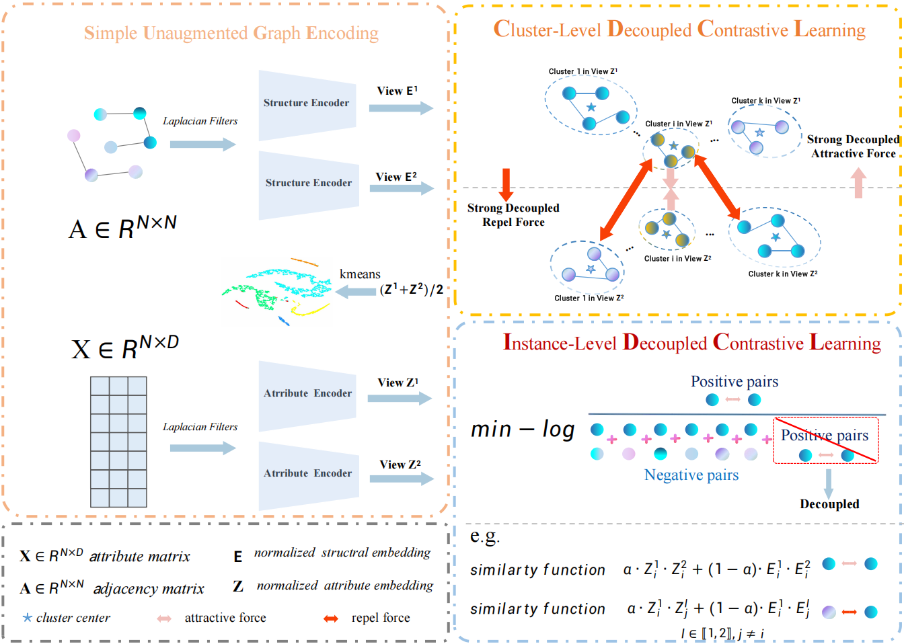

# Deep Comprehensive Graph Clustering (DCGC)

This repository contains the implementation of the Deep Comprehensive Graph Clustering algorithm.



## Overview

The proposed DCGC is implemented with Python 3.7 on two NVIDIA 1080Ti GPUs.

## Requirements

Python package information is summarized in requirements.txt:

torch==1.7.1
tqdm==4.59.0
numpy==1.19.2
munkres==1.1.4
scikit_learn==1.2.0

To install the required packages, run:
```
pip install -r requirements.txt
```

## Usage

To run the algorithm, use the loop.py script:

```
python loop.py
```


## Main Components

- `main.py`: Main entry point of the algorithm
- `model.py`: Implementation of the neural network model
- `opt.py`: Configuration and argument parsing
- `utils_dcl.py`: Utility functions including clustering algorithms
- `setup.py`: Setup functions for initialization
- `loop.py`: Script for running multiple experiments

## Results

Results are saved in `result.csv` after each run.
